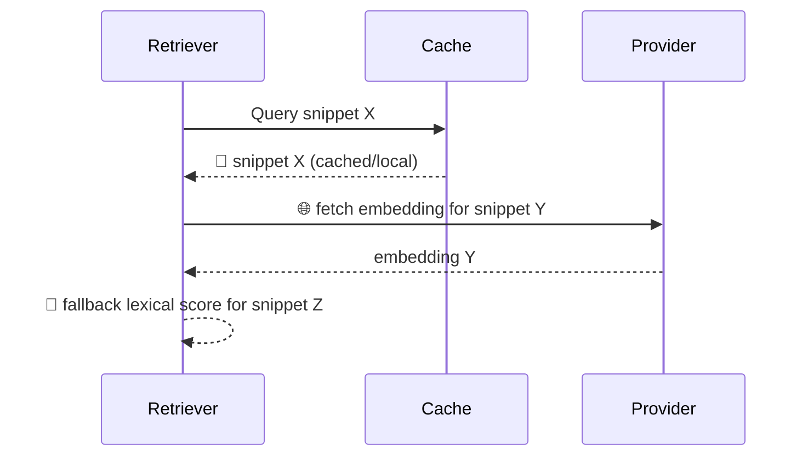

# Implementation Documentation Specification

**Status:** mandatory  
**Applies to:** all code implementation agents  
**Version:** 2026-03-11

## Purpose

Define the required documentation behavior that must be completed before and during implementation increments.

## Mandatory Pre-Implementation Lecture

Every implementation session must start with a mandatory lecture (read-through) of this specification before code changes begin.

Lecture protocol:
1. Read this file end-to-end.
2. Record lecture completion in the active feature `WORK_HISTORY.md` session entry.
3. Include lecture metadata: spec version, UTC timestamp, and agent identity/mode.
4. Do not start code changes until lecture completion is logged.

## One-Glance Marking Icons

- `✅` required / pass gate
- `⚠️` recommended / best practice
- `⛔` prohibited

## Visual Tagging Standard (Colorful Semantic Icons)

Use icons as compact semantic tags attached to specific items (rows, cells, nodes, or messages) to mark status/choice meaning at a glance.

Tagging rules:
1. Use meaning-aligned colorful icons as primary tags where rendering supports them.
2. Attach the tag directly to the tagged item (for example a table cell value, decision row, or sequence message label).
3. Use exactly one icon per tagged fact/status (do not combine multiple icons for one fact).
4. Keep tag semantics stable within a document.
5. Every tagged table/diagram/sequence must include its own local icon key (no shared/common key across artifacts).
6. Each local icon key must list all and only the symbols used in that specific artifact.
7. If color/icon rendering is unavailable, provide an ASCII fallback tag (`CACHE`, `LIVE`, `BLOCKED`, etc.).
8. For status matrices, use icon-only values in status cells; put the textual meaning in the local icon key, not in each cell.
9. Do not use abstract geometric symbols that encode only color/shape without concept meaning for the tagged fact.
10. Do not prefix icon keys with labels like `Legend:` or `Legend for this table:`; place the icon key directly below the artifact heading.

### Tag Icon Example

`📁` local/source-controlled artifact, `🌐` live/network fetch, `🚧` partial/incomplete, `🛑` blocked/failure, `🧪` experimental.

| Tag | Meaning | Typical Usage |
| --- | --- | --- |
| `📁` | Local artifact/context | Data item served from local project/source context |
| `🌐` | Live/network fetched | Provider/API retrieval path |
| `🚧` | Degraded/partial fallback | Fallback mode or partial evidence |
| `🛑` | Blocked/failure | Validation fail or hard-stop gate |
| `🧪` | Experimental path | Exploration-only behavior |

### Table Tagging Example

`📁` local context, `🌐` live fetch, `🚧` partial fallback, `🛑` blocked.

| Item | Retrieval Path | Status Tag | Notes |
| --- | --- | --- | --- |
| `memory_snippet_A` | local vector index | `📁` | cache hit in `project_domain` lane |
| `memory_snippet_B` | provider embedding call | `🌐` | live call required before ranking |
| `memory_snippet_C` | lexical fallback | `🚧` | missing embedding, partial confidence |
| `memory_snippet_D` | policy gate | `🛑` | blocked by dimension mismatch guard |

### Sequence Tagging Example (Mermaid)

`📁` local payload, `🌐` live fetch, `🚧` degraded fallback.

## Mandatory Rules Matrix

`✅` required/pass gate, `⚠️` recommended, `⛔` prohibited.

| Mark | Rule Area | Requirement | Enforcement Point |
| --- | --- | --- | --- |
| `✅` | Feature mapping | No implementation starts without a mapped active feature under `docs/active/features/`. | Session bootstrap |
| `✅` | High-level vs detail split | `README.md` remains high-level; implementation details go in `IMPLEMENTATION_NOTES.md` and `WORK_HISTORY.md`. | Doc review + PR/session check |
| `✅` | Pre-code detail plan | Update `IMPLEMENTATION_NOTES.md` with increment-level details before coding: data flow, contracts, algorithms, invariants, failure modes, verification plan. | Pre-implementation gate |
| `✅` | Mermaid usage | Non-trivial increments must include Mermaid diagrams in `IMPLEMENTATION_NOTES.md` (flow/sequence/state/dependency/component as applicable). | Doc completeness check |
| `✅` | Tradeoff format | Choices/variants/tradeoffs must be represented in tables (not prose-only). | Doc completeness check |
| `✅` | Visual tagging | Use colorful semantic icon tags to mark statuses/choices on items in tables/diagrams where supported. | Doc readability check |
| `✅` | Meaningful icon semantics | For status indicators, choose icons with concept meaning (for example `✅`, `🚧`, `🛑`, `🧭`, `🔥`), not abstract geometry-only markers. | Doc readability check |
| `✅` | Icon-only status cells | In status matrices, keep status cells icon-only and define meaning in the section icon key. | Doc readability check |
| `✅` | Icon key usage | Every tagged table/diagram/sequence must include its own local icon key in the same section. | Doc readability check |
| `✅` | Icon key exactness | Local icon key must contain all and only the symbols used in that specific artifact. | Doc readability check |
| `✅` | No legend label prefix | Do not use label prefixes like `Legend:` or `Legend for this table:` before icon keys. | Doc readability check |
| `✅` | Same-session sync | Completed implementation increments must update detailed docs in the same session/change stream. | End-of-session gate |
| `✅` | Work history linkage | `WORK_HISTORY.md` must explicitly reference implementation detail docs added/changed. | End-of-session gate |
| `✅` | Drift handling | If code and docs diverge, fix docs in the same change stream before marking increment complete. | Completion gate |
| `⚠️` | Table-first clarity | Prefer compact comparison tables with deterministic criteria and outcomes. | Authoring guideline |
| `⛔` | Readme overloading | Do not move low-level implementation detail into feature `README.md` as primary content. | Review gate |
| `⛔` | Stale visuals | Do not leave Mermaid diagrams/tables stale relative to shipped behavior. | Completion gate |

## Required Session Evidence

For each implementation session, `WORK_HISTORY.md` should include:

`✅` required evidence item.

| Mark | Evidence | Minimum Content |
| --- | --- | --- |
| `✅` | Lecture completion | Spec version/date + UTC timestamp |
| `✅` | Detailed-doc prep | `IMPLEMENTATION_NOTES.md` section(s) created or updated before coding |
| `✅` | Post-implementation sync | Files/sections updated to reflect shipped behavior |
| `✅` | Verification linkage | Commands/checks and outcomes tied to documented behavior |

## Minimum `IMPLEMENTATION_NOTES.md` Structure

`✅` required section.

| Mark | Section | Required Content |
| --- | --- | --- |
| `✅` | Increment scope | Exact increment boundary and non-goals |
| `✅` | Contracts | Input/output schemas, invariants, compatibility notes |
| `✅` | Flow diagram | Mermaid flow or sequence for runtime behavior |
| `✅` | Option table | Variant/choice table with semantic icon tags + local icon key |
| `✅` | Failure modes | Expected failures, detection, handling |
| `✅` | Verification plan | Deterministic checks and expected outcomes |

## Compliance Outcome

- Increment is implementation-ready only when lecture completion is logged and pre-code detail docs are updated.
- Increment is complete only when code, detailed docs, diagrams, and work-history evidence are synchronized.
