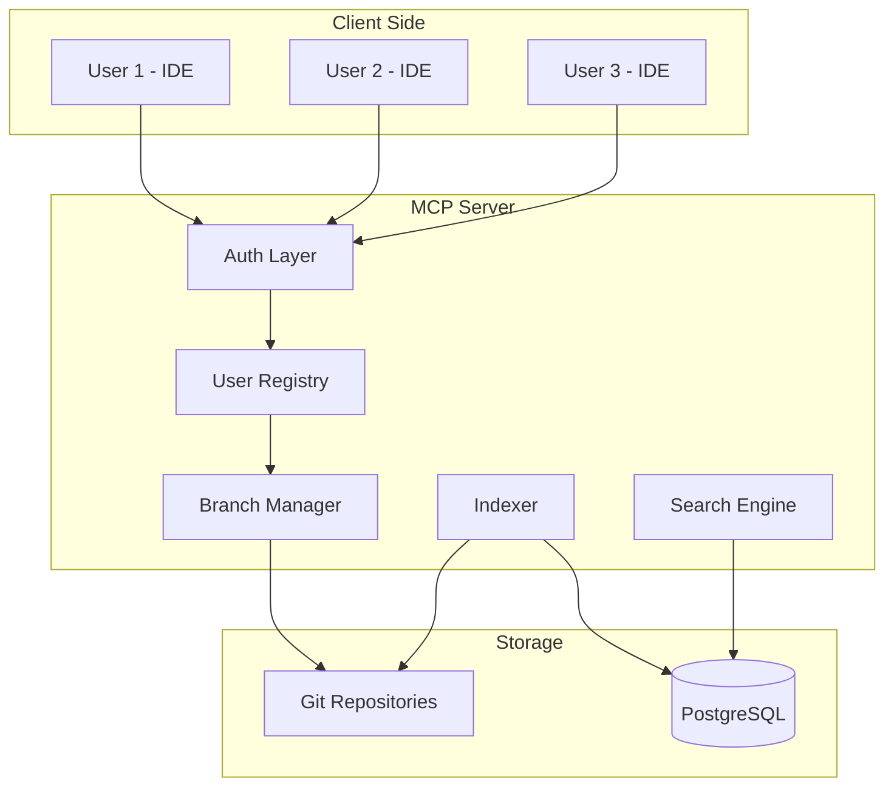
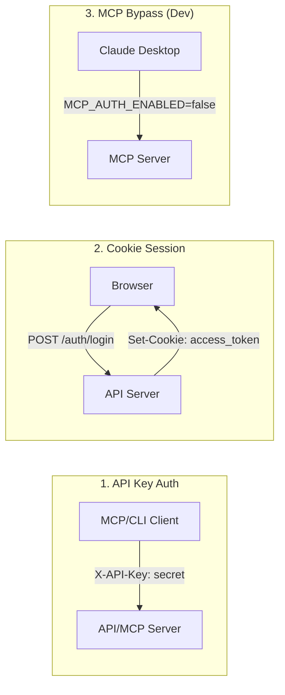
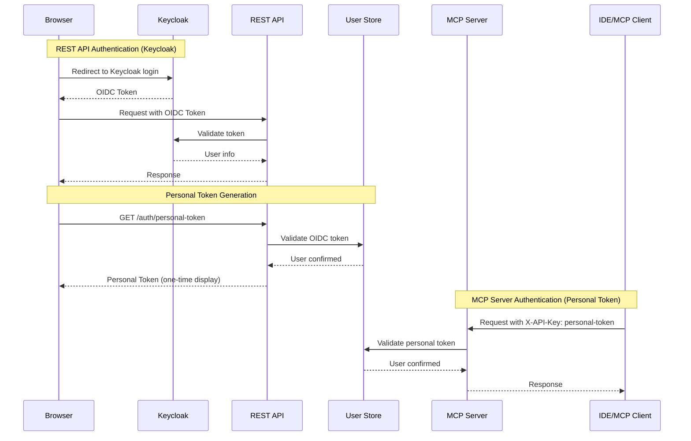
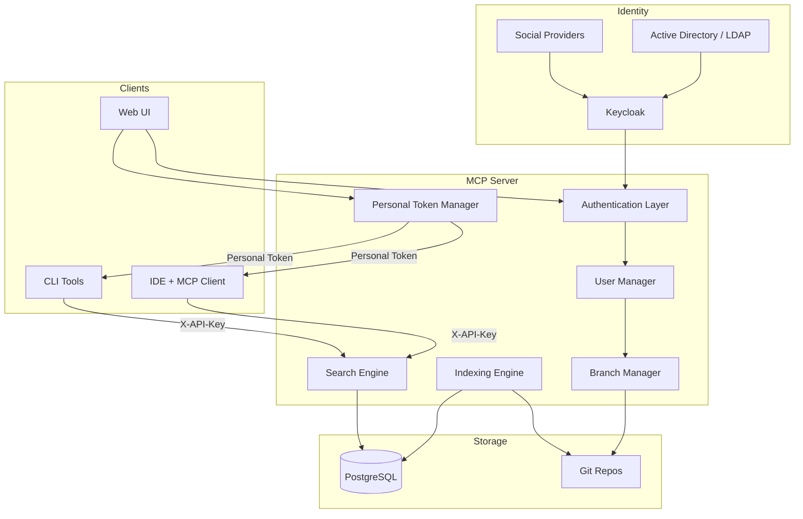

# Feature Ideas: Multi-User MCP Collaboration

## Idea 1: User Registration and Branch-Based Version Search

### Concept

Register all users connecting to the MCP server and allow them to push local changes to checked-out git branches. Make all versions searchable across MCP users.

### Current State

| Component | Status | Notes |
|-----------|--------|-------|
| User tracking | 🚧 Partial | `AuditLog` table has `user_id` column but no user management system |
| Git branch support | ✅ | Repositories are cloned with full git history |
| Per-user isolation | 🛑 Missing | No tenant/user isolation in data model |
| Cross-version search | 🛑 Missing | Search is per-repository, not per-branch |

### Architecture Considerations



### Key Components Needed

1. **User Registry**
   - User account storage (id, name, email, auth_provider)
   - Session tracking for MCP connections
   - API key or token per user

2. **Branch Manager**
   - Track user-owned branches per repository
   - Push local changes to user's branch
   - Branch isolation rules

3. **Version-Aware Indexing**
   - Index symbols per branch/version
   - Add `branch` dimension to `FileInstance` and `Symbol` models
   - Query across versions or target specific version

4. **Search Scope**
   - User's own version (default)
   - All users' versions (with permission)
   - Specific user's version

### Data Model Changes

```sql
-- New tables
CREATE TABLE users (
    id SERIAL PRIMARY KEY,
    external_id VARCHAR(255) UNIQUE,  -- from AD/OAuth
    email VARCHAR(255),
    display_name VARCHAR(255),
    created_at TIMESTAMPTZ
);

CREATE TABLE user_branches (
    id SERIAL PRIMARY KEY,
    user_id INTEGER REFERENCES users(id),
    repository_id INTEGER REFERENCES repositories(id),
    branch_name VARCHAR(500),
    last_push_at TIMESTAMPTZ,
    UNIQUE(user_id, repository_id, branch_name)
);

-- Modified tables
ALTER TABLE file_instances ADD COLUMN branch_name VARCHAR(500) DEFAULT 'main';
ALTER TABLE symbols ADD COLUMN branch_name VARCHAR(500) DEFAULT 'main';
```

### Implementation Phases

| Phase | Focus | Effort |
|-------|-------|--------|
| 1 | User registry + API key per user | Medium |
| 2 | Branch-aware indexing | High |
| 3 | Push local changes to branch | Medium |
| 4 | Cross-version search UI/API | Medium |

---

## Idea 2: Authentication and Active Directory Integration

### Current Authentication State

| Feature | Status | Implementation |
|---------|--------|----------------|
| API Key auth | ✅ | `X-API-Key` header, admin + read-only keys |
| Cookie session | ✅ | JWT in `access_token` cookie |
| MCP auth bypass | ✅ | `MCP_AUTH_ENABLED=false` for local dev |
| User database | 🛑 | No user table, only `admin` role |
| AD/LDAP | 🛑 | Not implemented |
| OAuth/OIDC | 🚧 | Placeholder endpoints exist |

### Current Auth Flow



### Active Directory Integration via Keycloak

Keycloak will serve as the identity broker, supporting:
- Active Directory / LDAP federation
- Social login providers (optional)
- Standard OIDC/OAuth2 protocols
- Fine-grained role-based access control

**Keycloak Configuration for AD:**
1. Add User Federation provider pointing to AD/LDAP
2. Configure Kerberos or LDAP authentication
3. Map AD groups to Keycloak roles
4. Application uses OIDC to authenticate against Keycloak

### Decided Approach: Keycloak for REST API + Personal Tokens for MCP

**Decision:** Use Keycloak as the primary identity provider for the REST API, with a new endpoint for generating personal tokens that can be used for MCP server authentication.

**Rationale:**
1. Keycloak supports multiple identity providers (AD, LDAP, social logins)
2. Centralized user management across the organization
3. Standard OIDC/OAuth2 protocols
4. Fine-grained role-based access control
5. Personal tokens bridge the gap for MCP clients that don't support OAuth flows

### Authentication Flow



### Personal Token Endpoint

```python
# New endpoint: POST /auth/personal-token
# Generates a long-lived API key tied to the authenticated user

class PersonalTokenRequest(BaseModel):
    name: str  # Token name for identification
    expires_in_days: int = 365  # Default 1 year

class PersonalTokenResponse(BaseModel):
    token: str
    name: str
    created_at: datetime
    expires_at: datetime

@router.post("/auth/personal-token")
async def create_personal_token(
    request: PersonalTokenRequest,
    current_user: dict = Depends(get_current_user_oidc)  # Keycloak auth
) -> PersonalTokenResponse:
    """Generate a personal API token for MCP server access."""
    # Token is stored hashed, returned once
    ...
```

### Configuration Additions

```python
# settings.py additions
class Settings(BaseSettings):
    # ... existing ...
    
    # Authentication method toggles (all can be enabled/disabled)
    auth_api_key_enabled: bool = True  # Existing X-API-Key auth
    auth_cookie_enabled: bool = True   # Existing cookie session
    auth_keycloak_enabled: bool = True # New Keycloak OIDC auth
    
    # Keycloak OIDC configuration
    keycloak_issuer: str = ""  # e.g., https://keycloak.company.com/realms/myrealm
    keycloak_client_id: str = ""
    keycloak_client_secret: str = ""
    
    # Personal tokens (for MCP)
    personal_token_enabled: bool = True
    personal_token_default_expiry_days: int = 365
    personal_token_max_expiry_days: int = 730  # 2 years max
```

### Implementation Plan (Parallel Session)

| Phase | Task | Effort |
|-------|------|--------|
| 1 | Add Keycloak OIDC client integration | Medium |
| 2 | Add `users` table synced from Keycloak | Medium |
| 3 | Implement personal token endpoint | Medium |
| 4 | Add auth method toggles to settings | Low |
| 5 | Map Keycloak roles to application roles | Low |
| 6 | Update MCP auth to accept personal tokens | Low |
| 7 | Audit logging per user | Low |

### Backward Compatibility

All existing authentication methods remain functional and can be toggled:

| Auth Method | Config Flag | Use Case |
|-------------|-------------|----------|
| API Key (admin/readonly) | `auth_api_key_enabled` | Service accounts, CI/CD |
| Cookie session | `auth_cookie_enabled` | Web UI access |
| Keycloak OIDC | `auth_keycloak_enabled` | Enterprise SSO |
| Personal tokens | `personal_token_enabled` | MCP clients |

---

## Combined Architecture Vision



---

## Open Questions

1. **Branch Isolation:** Should users see each other's branches by default, or opt-in?
2. **Merge Workflow:** How do changes from user branches get merged to main?
3. **Conflict Resolution:** What happens when multiple users edit the same file?
4. **Storage Cost:** Branch-aware indexing multiplies storage needs - what's the retention policy?
5. **Permission Model:** Should AD groups control repository access, branch access, or both?

---

## Next Steps

### Authentication (Parallel Session - Assumed Done)

1. ✅ Keycloak OIDC integration for REST API
2. ✅ Personal token endpoint for MCP access
3. ✅ Auth method toggles in configuration
4. ✅ User table synced from Keycloak

### Multi-User Collaboration (Future Work)

1. Design branch-aware indexing schema
2. Implement user registry with Keycloak sync
3. Add branch manager for user-owned branches
4. Implement cross-version search API
5. Define permission model for branch visibility
